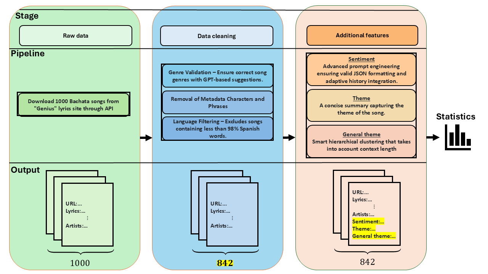
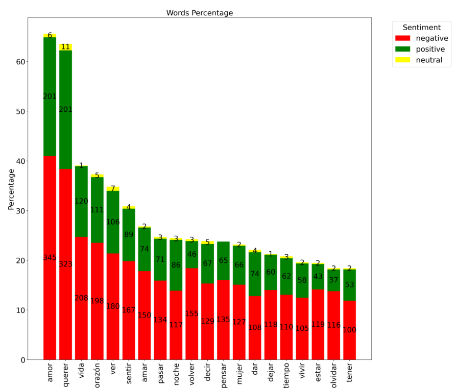
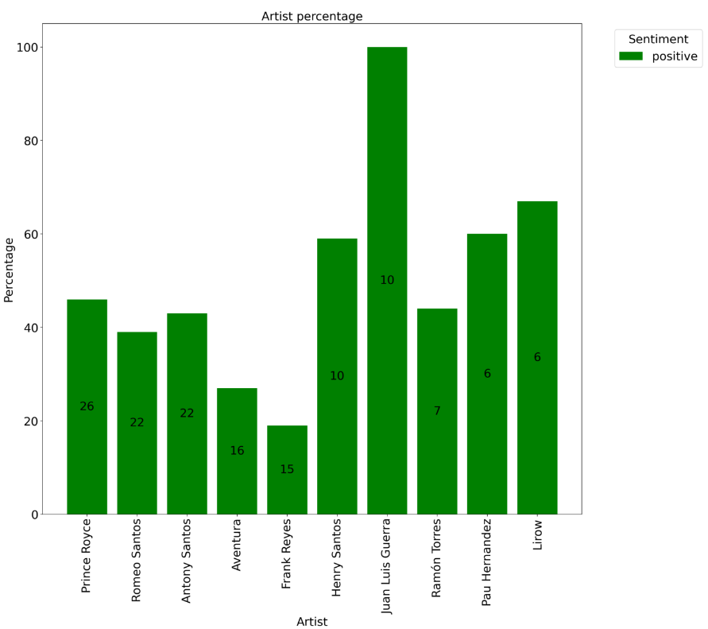
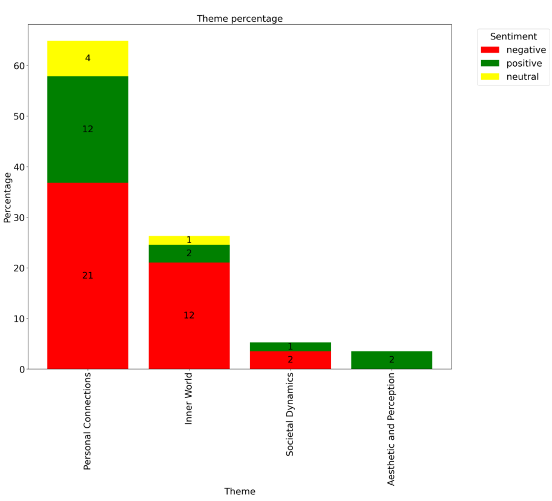

# Bachata music statistics

<p align="center">
  
</p>

## Table of Contents
- [Motivation](#motivation)
- [Pipeline](#pipeline) 
- [Usage](#usage)
- [Installation](#installation)
- [Corpus statistics](#corpus-statistics) 
- [Conclusions](#conclusions)

## Motivation
As a passionate Bachata dancer, I'm always looking for ways to deepen my connection with the music and improve my dancing. One important aspect of this is being able to understand and relate to the songs on a deeper level. However, since my Spanish comprehension is limited, I've often felt like I'm missing out on some of the rich emotional and thematic nuances that make Bachata music so powerful.
To bridge this gap, I decided to leverage my analytical skills and explore Bachata songs from a data-driven perspective. Here are some keyquestions that I thought that would help me better understand the music and, ultimately, become a more connected dancer:

* **What are the most common words, sentiments, artists, and themes in Bachata music?** When I know nothing about the song in advance.

* **How does knowing the sentiment of a song help predict its words or themes?** For instance, if a song has a negative sentiment, what can I expect the theme to be?

* **How does knowing the artist affect the expected themes or words in their songs?** Do certain artists consistently focus on particular themes or frequently use specific words in their songs?

**Example Conclusion** - In his music, Prince Royce often affectionately addresses women as "Baby", whereas Romeo Santos frequently uses "Mami" to convey a similar sentiment.

## Pipeline
<p align="center">
  
</p>

- **Raw data:** Download 1000 Bachata songs through Genius API.
- **Data cleaning:** Data Validation & Removal. At the end of the process 842 were remained.
- **Additional features:** Add for each song the folllowing features: _Sentiment_, _Theme_, _General theme_.
  - **Manual features validation:**
    - **Theme Accuracy:** Out of 54 tested themes, none were found to be incorrect.
    - **Sentiment Accuracy:**
      - Out of 18 songs labeled as "Neutral", 4 were misclassified (2 should have been "Positive" and 2 "Negative").
      - Out of 18 songs labeled as "Negative", all were correctly classified.
      - Out of 18 songs labeled as "Positive", 3 were misclassified (1 should have been "Neutral" and 2 "Negative").

#### What is Sentiment
Advance sentiment analysis not only identifies whether the emotional tone of a message is "Positive", "Negative", or "Neutral" but also considers the broader context in which the text is presented. For instance, in songs like "Eres Mía" by Romeo Santos, where the singer expresses possessive love and jealousy in an upbeat and seemingly happy tone, the sentiment is classified as mixed. Despite the positive tone, the underlying themes of possessiveness and jealousy introduce a negative moral context, which cause the overall sentiment to lean toward negative. Contextual analysis is crucial in capturing such nuances, allowing for a more accurate representation of sentiment.

Examples
Song with positive sentiment:
"Corazón Sin Cara" ("Heart Without a Face") by Prince Royce - Embracing and loving someone for who they are, beyond physical appearances and imperfections.

Song with negative sentiment:
"Los Infieles" ("The Unfaithful Ones") by Aventura - Engaging in a forbidden love affair despite the dangers and moral consequences.

## Usage
The statistics is showing in the application. There are two ways to run the application:
1) Run the app through the link: [Application](https://latinmusicstatistics-8ujlucqhrhmmsqsn3iamfg.streamlit.app/)
2) After the [Installation](#installation), run streamlit:
```
streamlit run gui_dir/gui.py
```
Then the App will present the following side bars:
<p align="center">
  
</p>

First choose the foreknowledge, then choose the specific analysis.
* General = no prior knowledge

## Installation
1. Git clone the repository:
```
git clone https://github.com/orlevit/latin_music_statistics.git
```
2. Create virtual environment with Pyhton 3.12.3
3. Install python packages within the virtual environment:
```
python install -r requirmentx.txt
```

## Corpus statistics
* There are 842 songs in the corpus.
* There corpus has 517 different artists.
* Average sentiment distribution (Averaging the sentiments of all the songs):
  * negative - Percentage: 49%.
  * positive - Percentage: 37%.
  * neutral - Percentage: 14%.
* Single sentiment distribution (The highest sentiment percentage is selected as the sentiment for a single song):
  * negative - Frequency: 516 | Percentage: 61%.
  * positive - Frequency: 312 | Percentage: 37%.
  * neutral - Frequency: 14 | Percentage: 2%.

* The average unique words per song is: 55.
* The prominent singer percentage:
  * Women - 9%.
  * Men - 79%.
  * Both - 12%.

## Conclusions
Examples of conclusions drawn from the statistics are provided below. For the complete list, please refer to the application.

### General (No prior knowledge)
#### Word Insight
* The words "querer" ("want") and "amor" ("love") occur at significantly higher rates compared to other terms, it might indicating that a majority of the songs focus on desire and love, likely emphasizing the longing for love.
<p align="center">
  
  <b>This graph presents the percentage of normalized unique word forms. Normalization refers to grouping variations of a word (e.g., "quero/quise" as forms of "querer"). Each unique word form, regardless of its frequency in a song, is counted only once. The unique normalized word frequencies are displayed above each corresponding bar, while the percentage represents the proportion of songs in which these words appear.</b>  
</p>

### Known sentiment
#### Sentiment: Positive
##### Word insight
* When the sentiment is "Positive," compared to "Negative" or "Neutral," there is a high probability that the event being described occurred at night, as the word "noche" ("night") appears more frequently.
<p align="center">
  
  <b>The graph illustrates the percentage of songs exhibiting specific sentiments for each artist, relative to their total number of songs. The percentage represents the proportion of songs with a specific sentiment relative to the artist's entire catalog, while the order reflects the frequency of that particular sentiment.</b>  
</p>

### Known artist
#### Artist: Romeo Santos
##### Theme insight
* His music deals a lot with contemplating the human "inner world" and his lyrics often delve into complex emotions.
<p align="center">
  
  <b>The proportion of songs categorized according to their sentiment distribution across various themes, with frequencies displayed above each bar.</b>
</p>
