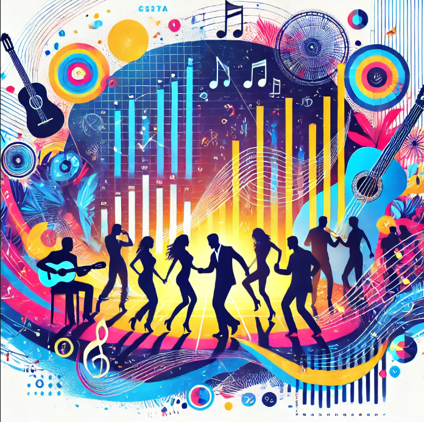
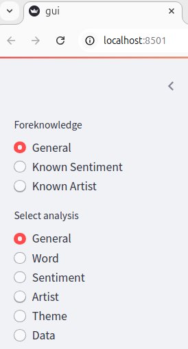

# Bachata music statistics

<p align="center">
  
</p>

## Table of Contents
- [Motivation](#motivation)
- [Usage](#usage)
- [Installation](#installation)
- [Corpus statistics](#corpus-statistics)
- [Data preprocess](#data-preprocess)
- [Conclusions](#conclusions)

## Motivation
As a passionate Bachata dancer, I'm always looking for ways to deepen my connection with the music and improve my dancing. One important aspect of this is being able to understand and relate to the songs on a deeper level. However, since my Spanish comprehension is limited, I've often felt like I'm missing out on some of the rich emotional and thematic nuances that make Bachata music so powerful.
To bridge this gap, I decided to leverage my analytical skills and explore Bachata songs from a data-driven perspective. Here are some keyquestions that I thought that would help me better understand the music and, ultimately, become a more connected dancer:

* **What are the most common words, sentiments, artists, and themes in Bachata music?** When I know nothing about the song in advance.

* **How does knowing the sentiment of a song help predict its words or themes?** For instance, if a song has a negative sentiment, what can I expect the theme to be?

* **How does knowing the artist affect the expected themes or words in their songs?** Do certain artists consistently focus on particular themes or frequently use specific words in their songs?

### Key Conclusion:

#### General (No prior knowledge)
* The words "querer" ("want") and "amor" ("love") occur at significantly higher rates compared to other terms, it might indicating that a majority of the songs focus on desire and love, likely emphasizing the longing for love.

* It is most likely that a song will convey a negative sentiment.

* The predominant themes "Love and Relationships", "Heartbreak and Loss" and "Toxic Relationships" are representative of approximately 71% of the corpus. Notably, many of these songs delve into the complexities of deep emotional connections, often focusing on ongoing or concluded relationships rather than those in their initial stages.

#### Known sentiment
* When the sentiment is "Positive," compared to "Negative" or "Neutral," there is a high probability that the event being described occurred at night, as the word "noche" ("night") appears more frequently.

#### Known artist:
##### Romeo Santos
* Emphasizes his name and the term "king", which may indicate a high opinion of himself and affectionately refers to women as "Mami".

* His music deals a lot with contemplating the human "inner world" and his lyrics often delve into complex emotions.

##### Prince Royce
* Often emphasizes his name and affectionately refers to women as "Baby".

* One of his musical themes is "Forbidden Love" which usually involves falling in love with an unavailable person and focuses on the emotional highs and the thrill of love.

## Usage
There are two ways to run the app:
1) Run the app through the link: #########################################
2) After the [Installation](#installation), run streamlit:
```
streamlit run gui_dir/gui.py
```
Then the App will present the following side bars:
<p align="center">
  
</p>

First choose the foreknowledge, then choose the specific analysis.
* General = no prior knowledge

## Installation
1. Git clone the repository:
```
git clone https://github.com/orlevit/latin_music_statistics.git
```
2. Create virtual environment with Pyhton 3.12.3
3. Install python packages within the virtual environment:
```
python install -r requirmentx.txt
```
  
## Corpus statistics
* There are 842 songs in the corpus.
* There corpus has 517 different artists.
* Average sentiment distribution (Averaging the sentiments of all the songs):
  * negative - Percentage: 49%.
  * positive - Percentage: 37%.
  * neutral - Percentage: 14%.
* Single sentiment distribution (The highest sentiment percentage is selected as the sentiment for a single song):
  * negative - Frequency: 516 | Percentage: 61%.
  * positive - Frequency: 312 | Percentage: 37%.
  * neutral - Frequency: 14 | Percentage: 2%.

* The average unique words per song is: 55.
* The prominent singer percentage:
  * Women - 9%
  * Men - 79%
  * Both - 12%.

## Data preprocess
The original corpus consists of 1,000 songs, which were downloaded using the "Genius" API, with a focus on the Bachata genre.
Out of those 1000, only 842 remained.
Below are the steps followed during the preprocessing phase:

#### Data Collection
- **Source:** The song lyrics were retrieved via the "Genius" API.
- **Genre:** All songs were classified under the "Bachata" genre.
  
#### Data Filtering

#### Genre Validation
- **ChatGPT-Assisted Validation:** Each song's genre was reviewed with the assistance of ChatGPT to ensure it was correctly classified as Bachata. If a song was incorrectly labeled, it was listened to for verification.
  
#### Language Filtering
- **Spanish Word Count:** Songs with less than 98% Spanish words were excluded from the corpus.
  
#### Song Annotation
Each song was further processed by assigning two key attributes:
1. **Theme:** A short summary that describes the overall theme of the song.
2. **Sentiment:** The sentiment of the song, categorized as either "Neutral", "Negative", or "Positive".

#### Manual Validation of Annotations
- **Theme Accuracy:** Out of 54 tested themes, none were found to be incorrect.
- **Sentiment Accuracy:**
  - Out of 18 songs with "Neutral" sentiment, 5 were misclassified (3 should have been "Positive" and 2 "Negative").
  - All songs labeled as "Negative" were correctly classified.
  - For songs labeled as "Positive", 3 were misclassified (1 should have been "Neutral" and 2 "Negative").

#### Data Cleanup
An iterative process was applied to ensure that the lyrics were free from non-lyrical content:
- **Manual Examination:** Multiple phrases and non-lyrical elements (e.g., advertisements or artist comments) were manually removed from the lyrics. This process was repeated until 50 consecutive songs were found to have no extraneous content.

#### Sentiment
Advance sentiment analysis not only identifies whether the emotional tone of a message is positive, negative, or neutral but also considers the broader context in which the text is presented. For instance, in songs like "Eres Mía" by Romeo Santos, where the singer expresses possessive love and jealousy in an upbeat and seemingly happy tone, the sentiment is classified as mixed. Despite the positive tone, the underlying themes of possessiveness and jealousy introduce a negative moral context, which cause the overall sentiment to lean toward negative. Contextual analysis is crucial in capturing such nuances, allowing for a more accurate representation of sentiment.

Examples
Song with positive sentiment:
"Corazón Sin Cara by Prince Royce" - Embracing and loving someone for who they are, beyond physical appearances and imperfections (described with warm words).

Song with negative sentiment:
"Los Infieles by Aventura" - Engaging in a forbidden love affair despite the dangers and moral consequences (described by both positive and negative emotions).

## Conclusions

### General (No prior knowledge)
#### Word Insight
* The words "querer" ("want") and "amor" ("love") occur at significantly higher rates compared to other terms, it might indicating that a majority of the songs focus on desire and love, likely emphasizing the longing for love.

* Although the precise meaning of the text may not be immediately clear from the words themselves, the predominantly negative sentiment, combined with terms that imply change, such as "dejar" ("leave"), "volver" ("return"), and "olvidar" ("forget") - points to an underlying theme of loss, most likely the loss of love.
  
* To fully comprehend the song, in addition to understanding its grammar, one needs to have a familiarity with an average of 55 words.

* When the artists think ("pensar"), the word usually (~67%) exists in songs with a negative sentiment, it may be more beneficial for them to refrain from such contemplation.

* The word "vida" ("life") is usually (~63%) used in songs with a negative sentiment. This may suggests that bachata singers often express negative emotional themes in their lives.

#### Artist Insight
* Out of the graph above, only artists with more than 20 songs are considered sufficient and included in the analysis:
    * The five most frequent artists appear in 36% of the songs, with a significant drop in the presence of other artists beyond this point. This indicates that the vocabulary, sentiment, and themes conveyed by these prominent artists have a major impact on the overall statistics.

    * Frank Reyes and Ralphy Dreamz tend to produce a significantly higher volume of negative-themed songs compared to their peers.

#### Sentiment Insight
* It is most likely that a song will convey a negative sentiment.

* The negative and positive songs exhibit a comparable level of neutral sentiment in their lyrics (~14%).

* Interestingly, some songs demonstrate a neutral sentiment. Upon analysis, it seems these songs can be interpreted as either positive or negative depending on the listener’s perspective. As a result, the model refrained from assigning a definitive sentiment and instead classified them with a high neutral value.

* The majority of "Neutral" songs are attributed to less frequent or lesser-known artists, suggesting that more prominent or well-known singers tend to convey clearer, more distinct sentiments, whether "Negative" or "Positive".

#### Theme Insight
* The predominant themes "Love and Relationships", "Heartbreak and Loss" and "Toxic Relationships" are representative of approximately 71% of the corpus. Notably, many of these songs delve into the complexities of deep emotional connections, often focusing on ongoing or concluded relationships rather than those in their initial stages. When exploring the theme of "Critique of Love," it becomes evident that this encompasses a broader critique of love itself, as well as specific commentary on contemporary relationships.

* The theme of "Toxic Relationships" inherently conveys a negative connotation and cannot be interpreted in any other light.

### Known sentiment
#### --- Positive ---
#### Word Insight
* When the sentiment is "Positive," compared to "Negative" or "Neutral," there is a high probability that the event being described occurred at night, as the word "noche" ("night") appears more frequently.
  
* When the sentiment is "Positive," the use of words like "Mujer" ("Woman"), "Mami," and "Baby" suggests two things:
  * A significant presence of male artists in the dataset.

  * That when the singer is in a positive mood, he is more likely to refer to his partner using affectionate terms or nicknames.

#### Artist Insight
An analysis of artists with a substantial discography (over 20 songs) reveals that:
* Prince Royce stands out as one of the most positive, with approximately every other song carrying an optimistic view.

* Interestingly, although Juan Luis Guerra does not have an extensive catalog of songs, each one carries a positive sentiment.

#### Theme Insight
* When the sentiment is "Positive," the most likely theme is "Love and Relationships."


#### --- Negative ---
#### Word Insight
* When the sentiment is "Negative" the word "Morir" ("Die") frequently appears, suggesting that when the singer suffers, it is in its most extreme form.
 
#### Artist Insight
An analysis of artists with a substantial discography (over 20 songs) reveals that:
* Frank Reyes is one of the most negative artists, with nearly 80% of his tracks expressing predominantly negative sentiment.
  
#### Theme Insight
When the sentiment is "Negative," the most likely theme is "Heartbreak and Loss."

### Known artist

#### Romeo Santos
* Emphasizes his name and the term "king", which may indicate a high opinion of himself.

* Affectionately refers to women as "Mami".

* His music deals a lot with contemplating the human "inner world" and his lyrics often delve into complex emotions.

#### Prince Royce
* Often emphasizes his name.

* Affectionately refers to women as "Baby".

* One of his musical themes is "Forbidden Love" which usually involves falling in love with an unavailable person and focuses on the emotional highs and the thrill of love.

#### Aventura
* Highlights their band name, which is fitting given that Romeo Santos is a member of the group.

* One of their musical themes is "Desire for Deeper Connection", which may reflects the songwriter's inclination toward having superficial relationships.
