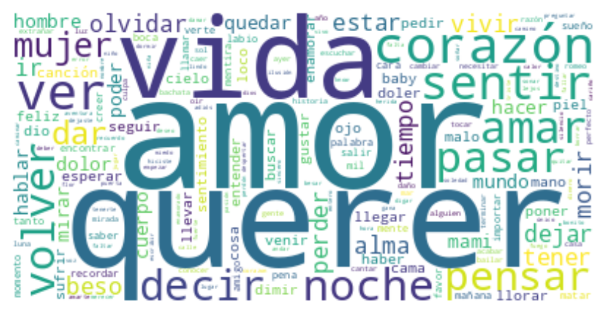

# Batchata music statistics

<p align="center">
  
</p>

This is statistics regarding Batchata songs.

As a batchata dancer I always searching for a way to improve my dace. One way is to relate to the song.

Since I do not have high Spanish understanding, I used my analytical skills to get insights and answers for the follwoing questions:

What is the most likely word/sentiment/artist/themes, when I have the previous knowledge:
* No previous knowledge.
* If I know the sentiment of the song.
* If I know the artist in the song.

## Table of Contents
- [Installation](#installation)
- [Usage](#usage)
- [Corpus_statistics](#Corpus_statistics)
- [Process](#Process)
- [Conclusions](#Conclusions)


## Installation
1. Git clone the repository:
```
git clone https://github.com/orlevit/latin_music_statistics.git
```
2. Create virtual environment.
3. Install python packages within the virtual environment:
```
python install -r requirmentx.txt
```

## Usage
Run streamlit:
```
streamlit run gui_dir/gui.py
```

## Corpus_statistics
* There are 842 songs in the corpus.
* There corpus has 517 different artists.
* Average sentiment distribution (Averaging the sentiments of all the songs):
  * negative - Percentage: 74.11%.
  * positive - Percentage: 56.78%.
  * neutral - Percentage: 27.90%.
* Single sentiment distribution (The highest sentiment percentage is selected as the sentiment for a single song):
  * negative - Frequency: 516 | Percentage: 61.28%.
  * positive - Frequency: 312 | Percentage: 37.05%.
  * neutral - Frequency: 14 | Percentage: 1.66%.

* The average unique words per song is: 55.
* The prominent singer percentage:
  * Women - 9.03%
  * Men - 78.5%
  * Both - 12.47%.

## Data preProcess

# Preprocessing Corpus of Bachata Song Lyrics

The original corpus consists of 1,000 songs, which were downloaded using the "Genius" API, with a focus on the Bachata genre.
Out of those 1000, only 842 remained.
Below are the steps followed during the preprocessing phase:

## Data Collection
- **Source:** The song lyrics were retrieved via the "Genius" API.
- **Genre:** All songs were classified under the "Bachata" genre.
  
## Data Filtering

### Genre Validation
- **ChatGPT-Assisted Validation:** Each song's genre was reviewed with the assistance of ChatGPT to ensure it was correctly classified as Bachata. If a song was incorrectly labeled, it was listened to for verification.
  
### Language Filtering
- **Spanish Word Count:** Songs with less than 98% Spanish words were excluded from the corpus.
  
## Song Annotation

Each song was further processed by assigning two key attributes:
1. **Theme:** A short summary that describes the overall theme of the song.
2. **Sentiment:** The sentiment of the song, categorized as either "Neutral", "Negative", or "Positive".

### Manual Validation of Annotations
- **Theme Accuracy:** Out of 54 tested themes, none were found to be incorrect.
- **Sentiment Accuracy:**
  - Out of 18 songs with "Neutral" sentiment, 5 were misclassified (3 should have been "Positive" and 2 "Negative").
  - All songs labeled as "Negative" were correctly classified.
  - For songs labeled as "Positive", 3 were misclassified (1 should have been "Neutral" and 2 "Negative").

## Data Cleanup

An iterative process was applied to ensure that the lyrics were free from non-lyrical content:
- **Manual Examination:** Multiple phrases and non-lyrical elements (e.g., advertisements or artist comments) were manually removed from the lyrics. This process was repeated until 50 consecutive songs were found to have no extraneous content.

## Conclusions

# General
General Word Insight
The words "querer" ("want") and "amor" ("love") occur at significantly higher rates, indicating a focus on desire and love, emphasizing longing for love.
Predominantly negative sentiment, combined with terms implying change (e.g., "dejar" ("leave"), "volver" ("return"), "olvidar" ("forget")), points to an underlying theme of loss, likely the loss of love.
Understanding the song requires familiarity with an average of 55 words in addition to grammar comprehension.
Artists thinking ("pensar") typically have a ~67% occurrence in songs with negative sentiment; refraining from such contemplation may be more beneficial.
The word "vida" ("life") is used ~63% in songs with negative sentiment, suggesting bachata singers often express negative emotional themes.
General Artist Insight
Only artists with more than 20 songs are included in the analysis:
The five most frequent artists appear in 36% of the songs, significantly impacting vocabulary, sentiment, and themes.
Frank Reyes and Ralphy Dreamz produce a higher volume of negative-themed songs compared to peers.
Prince Royce is recognized as one of the most optimistic and positive artists in the bachata music industry.
General Sentiment Insight
A song is most likely to convey a negative sentiment.
Negative and positive songs exhibit a comparable level of neutral sentiment in their lyrics (~14%).
Some songs demonstrate neutral sentiment, interpreted as either positive or negative depending on the listener’s perspective; the model classifies them with a high neutral value.
Most "Neutral" songs are attributed to less frequent or lesser-known artists; well-known singers convey clearer sentiments (either "Negative" or "Positive").
General Theme Insight
Predominant themes include "Love and Relationships," "Heartbreak and Loss," and "Toxic Relationships," representing approximately 71% of the corpus, focusing on deep emotional connections and ongoing or concluded relationships.
The theme of "Toxic Relationships" conveys a negative connotation and cannot be interpreted otherwise.


# Known sentiment

Known Sentiment Word Insight (Positive)
When the sentiment is "Positive," compared to "Negative" or "Neutral," there is a high probability that the event being described occurred at night, as the word "noche" ("night") appears more frequently.
When the sentiment is "Positive," the use of words like "Mujer" ("Woman"), "Mami," and "Baby" suggests two things:
A significant presence of male artists in the dataset.
That when the singer is in a positive mood, he is more likely to refer to his partner using affectionate terms or nicknames.
Known Sentiment Word Insight (Negative)
When the sentiment is "Negative," the word "Morir" ("Die") frequently appears, suggesting that when the singer suffers, it is in its most extreme form.
Known Sentiment Artist Insight (Positive)
An analysis of artists with a substantial discography (over 20 songs) reveals that:
Prince Royce stands out as one of the most positive, with approximately every other song carrying an optimistic view.
Interestingly, although Juan Luis Guerra does not have an extensive catalog of songs, each one carries a positive sentiment.
Known Sentiment Artist Insight (Negative)
An analysis of artists with a substantial discography (over 20 songs) reveals that:
Frank Reyes is one of the most negative artists, with nearly 80% of his tracks expressing predominantly negative sentiment.
Known Sentiment Theme Insight (Positive)
When the sentiment is "Positive," the most likely theme is "Love and Relationships."
Known Sentiment Theme Insight (Negative)
When the sentiment is "Negative," the most likely theme is "Heartbreak and Loss."

# Known artist

Romeo Santos
Emphasizes his name and the term "king", indicating a high opinion of himself.
Affectionately refers to women as "Mami".
His music deals with contemplating the human "inner world" and often delves into complex emotions.

Prince Royce
Often emphasizes his name.
Affectionately refers to women as "Baby".
One of his musical themes is "Forbidden Love", involving love with an unavailable person and focusing on the emotional highs and thrill of love.

Aventura
Highlights their band name, fitting since Romeo Santos is a member of the group.
One of their musical themes is "Desire for Deeper Connection", reflecting an inclination toward superficial relationships.
